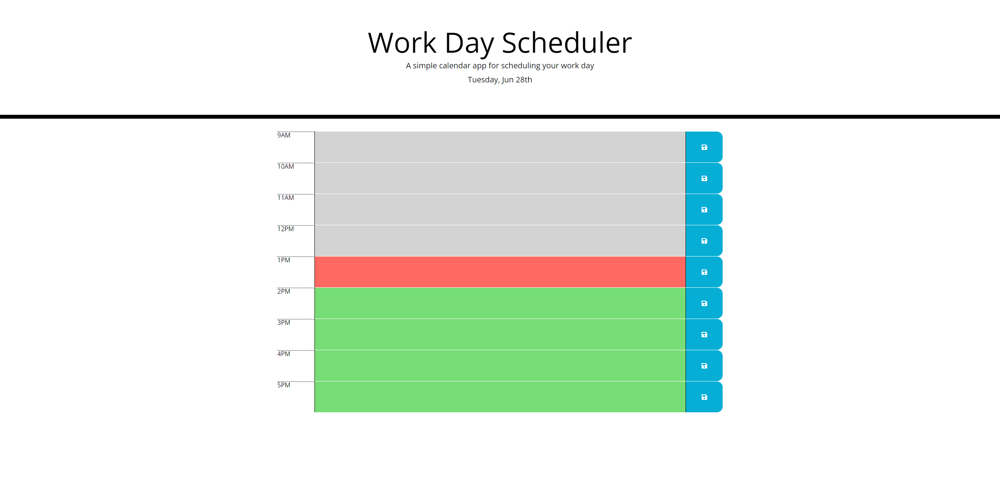

# module-5-challenge

### Description

* created the day/date to reflect as the current date on the application
* use functions to display the current date
* use functions to display all rows of timeblocks
* saved to local storage
* all of this allows for the user to create tasks in the calendar for a specific hour of the day while the application shows the current date. User has the ability to save these tasks and as time passes by the color of the task box will change.

### Screenshot

### Link

